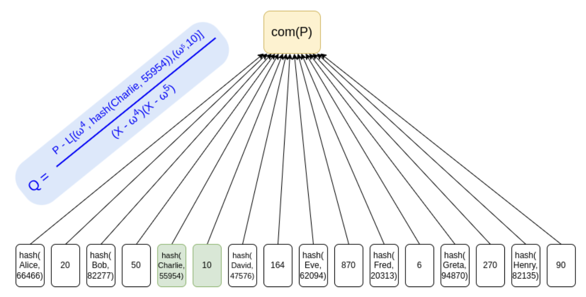
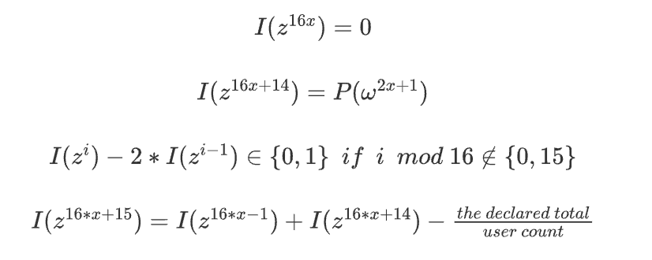

<p align="center">
    
    
</p>

#### Description

An [arkworks](https://github.com/arkworks-rs/) implementation of the protocol described by V. Buterin in [*Having a safe CEX: proof of solvency and beyond*](https://vitalik.ca/general/2022/11/19/proof_of_solvency.html). 

The idea is to perform a proof of solvency of a centralized exchange (CEX) by proving that the CEX assets are greater than its liabilities. We implement two of the main working pieces:

1. A polynomial $P(X)$, consisting of the users' usernames and balances is lagrange interpolated and committed to using KZG. Users will be able to verify that they have been included in this polynomial using a multi-opening proof.

<p align="center">
  
</p>

2. An auxiliary polynomial $I(X)$, whose main role is to allow the CEX to perform additional auxiliary multi-opening KZG proofs, all building up to show that the sum of the users' balances matches a declared total. 

<p align="center">
  
</p>

#### Usage

This repo feats an example, which you can run with:

```bash
cargo run --release --example kzg_solvency
```

For tests, run:

```bash
cargo test --release
```